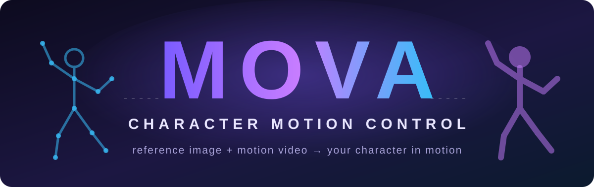
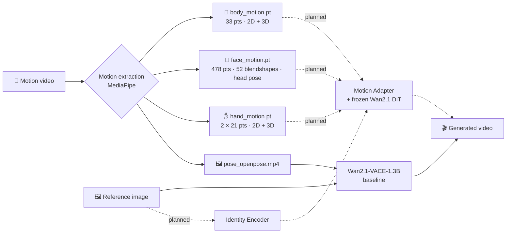
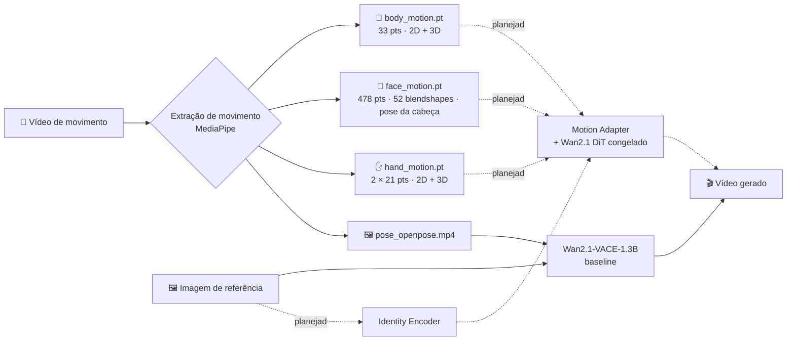

<div align="center">



<br>

<h3>Motion Control de Personagens · open-source · low-VRAM</h3>

<br>

<p>
🖼️ <b>Reference image</b> &nbsp;+&nbsp; 🎥 <b>Motion video</b><br>
⬇️<br>
🎬 <b>Your character performing the motion</b>
</p>

<br>

<p>
🕺 &nbsp;Full-body motion transfer · <i>Transferência de movimento do corpo</i><br><br>
🙂 &nbsp;Facial expression &amp; head pose · <i>Expressão facial e pose da cabeça</i><br><br>
✋ &nbsp;Hands &amp; fingers · <i>Mãos e dedos</i><br><br>
👤 &nbsp;Identity preservation · <i>Preservação de identidade</i><br><br>
🎞️ &nbsp;Temporal consistency · <i>Consistência temporal</i><br><br>
⚡ &nbsp;Designed for 8 GB VRAM · <i>Projetado para 8 GB de VRAM</i>
</p>

<br>


<br>
<br>

### 🌐 &nbsp; **[English](#-english)** &nbsp;·&nbsp; **[Português](#-português)**

</div>

---

## 🇺🇸 English

### ✨ What is MOVA?

MOVA is a **modular, low-VRAM character animation system**. You give it one reference image of a character and a video of someone moving, and it generates a video of **your character performing that motion**. It aims to keep:

| Identity | Motion | Temporal |
|---|---|---|
| 👤 face, hair, outfit, body proportions | 🕺 body pose and orientation | 🎞️ frame-to-frame consistency |
| 🎨 overall appearance | 🙂 facial expression and head pose | 🚫 no flicker |
| | ✋ hands and fingers | |

It is built to run on a **consumer GPU with 8 GB of VRAM**. The pretrained video backbone stays **frozen**, and only small modules (encoders and adapters) get trained.

> [!NOTE]
> MOVA follows technical principles that are **publicly documented** (for example the Kling-MotionControl technical report and the open Wan-Animate papers). It **does not** copy or claim to reproduce any proprietary architecture, code or weights.

### 🧭 How it works



**Planned architecture:** separate motion encoders for body, face and hands feed a projection layer, temporal attention and a zero-initialized **Motion Adapter**, which injects into the **frozen Wan2.1 DiT (1.3B)**. An **Identity Encoder** adds tokens describing who the character is. The short version: *identity = who, motion = what they're doing.*

### 📊 Project status

| Phase | Description | Status |
|---|---|---|
| 0 | Research: models, licenses, VRAM, Kling public analysis | ✅ Done |
| 1 | Baseline: Wan2.1-VACE-1.3B inference | 🟡 Code ready, not yet run with real weights (needs the GPU) |
| 2 | Motion extraction: body, face and hands | ✅ Works on CPU |
| 3 | Motion Encoder + Temporal Attention + Adapter | ⏳ Planned |
| 4 | Identity system | ⏳ Planned |
| 5 | Training (LoRA / adapters, 8 GB) | ⏳ Planned |
| 6 | Automated evaluation | ⏳ Planned |

The live, verified state is in [STATUS.md](STATUS.md).

### 🚀 Quickstart

```bash
# 1. Environment
py -3.12 -m venv .venv
.venv/Scripts/python -m pip install torch --index-url https://download.pytorch.org/whl/cu128   # GPU (CPU: /whl/cpu)
.venv/Scripts/python -m pip install -r requirements.txt
.venv/Scripts/python -m pip install -e . --no-deps          # installs the `mova` command

# 2. Check hardware, runtimes and models
mova info
mova info --model wan

# 3. Run tests
mova test -q
```

**Extract motion** (runs on CPU):

```bash
mova preprocess --video assets/motion/dance.mp4 --out outputs/motion/dance
```

This writes `body_motion.pt`, `face_motion.pt`, `hand_motion.pt`, preview videos and an OpenPose-style control video.

**Run the baseline** (needs a GPU; downloads 19 GB only when `--allow-download` is given):

```bash
.venv/Scripts/python scripts/check_model_size.py Wan-AI/Wan2.1-VACE-1.3B-diffusers
mova infer --model wan --runtime pytorch --device auto --precision auto            --reference assets/reference/maya.png --motion assets/motion/dance.mp4 --output outputs/maya_dance.mp4 --allow-download
```

`mova infer --model tiny ...` runs the whole stack with a tiny random network (no downloads, output is noise): a
smoke test for any machine. Runtime, device and precision come from `configs/runtime.yaml` or the flags; see
[docs/architecture.md](docs/architecture.md) for the Core / Model / Runtime layers.

### 🧠 Low-VRAM strategy

| Technique | Where |
|---|---|
| Frozen 1.3B DiT backbone, only small adapters trained | architecture |
| UMT5 text encoder runs **once on CPU**, embeddings cached | `inference/baseline_vace.py` |
| Automatic profile: resolution and frames (`common/env.py`); device, precision and offload | `runtime/` |
| Model / sequential CPU offload + VAE tiling | baseline |
| 256 px · 17 frames · batch 1 · bf16 on 8 GB | default profile |

### 📁 Project layout

```text
mova/            `mova` command line (thin; calls core/)
core/            inference service, config precedence, capability validation, info
models/          model interface, registry, backbones/ (Wan2.1-VACE)   · identity/motion/adapters (planned)
runtime/         Runtime interface, PyTorch runtime, device / precision / memory managers
common/          hardware summary, YAML config, experiment tracking, video I/O, errors
preprocessing/   body / face / hands extractors, motion features, rendering
inference/       baseline pipeline and conditioning helpers
training/        training loop and losses                                  (planned)
evaluation/      integrity, motion metrics, benchmark comparison
scripts/         check_env · check_model_size · benchmark · (extract_motion, inference_baseline: CLI wrappers)
configs/         YAML configs
docs/            research, architecture, pipeline, inference, training, datasets, experiments
```

### 📚 Documentation

| Doc | What's inside |
|---|---|
| [docs/research/](docs/research/) | Sources, backbone selection, Kling / Wan / MimicMotion / AnimateAnyone analyses |
| [docs/architecture.md](docs/architecture.md) | Current and planned architecture |
| [docs/pipeline.md](docs/pipeline.md) | Motion data format (`.pt` keys and shapes) |
| [docs/inference.md](docs/inference.md) | Baseline usage and memory strategy |
| [docs/training.md](docs/training.md) | Training plan and why each loss exists |
| [docs/dataset.md](docs/dataset.md) | Datasets and licenses |
| [DECISIONS.md](DECISIONS.md) | Architecture Decision Records |
| [CLAUDE.md](CLAUDE.md) · [AGENTS.md](AGENTS.md) · [HANDOFF.md](HANDOFF.md) | Guides for AI agents and session handoff |

### 🙏 Built on

[Wan2.1](https://github.com/Wan-Video/Wan2.1) · [VACE](https://github.com/ali-vilab/VACE) · [Wan-Animate](https://arxiv.org/abs/2509.14055) · [🤗 Diffusers](https://github.com/huggingface/diffusers) · [MediaPipe](https://developers.google.com/edge/mediapipe) · [DiffSynth-Studio](https://github.com/modelscope/DiffSynth-Studio). Ideas come from MimicMotion, Animate Anyone, UniAnimate-DiT and the Kling-MotionControl technical report. See [sources.md](docs/research/sources.md).

---

## 🇧🇷 Português

### ✨ O que é o MOVA?

O MOVA é um **sistema modular de animação de personagens, feito para pouca VRAM**. Você fornece uma imagem de referência da personagem e um vídeo de alguém se movendo, e ele gera um vídeo com **a sua personagem fazendo aquele movimento**. O objetivo é preservar:

| Identidade | Movimento | Temporal |
|---|---|---|
| 👤 rosto, cabelo, roupa, proporções do corpo | 🕺 pose e orientação do corpo | 🎞️ consistência entre frames |
| 🎨 aparência geral | 🙂 expressão facial e pose da cabeça | 🚫 sem flicker |
| | ✋ mãos e dedos | |

Ele foi feito para rodar numa **GPU de consumo com 8 GB de VRAM**. O backbone de vídeo pré-treinado fica **congelado**, e só módulos pequenos (encoders e adapters) são treinados.

> [!NOTE]
> O MOVA segue princípios técnicos **publicamente documentados** (por exemplo o technical report do Kling-MotionControl e os papers abertos do Wan-Animate). Ele **não** copia nem afirma reproduzir nenhuma arquitetura, código ou peso proprietário.

### 🧭 Como funciona



**Arquitetura planejada:** encoders de movimento separados para corpo, rosto e mãos alimentam uma camada de projeção, atenção temporal e um **Motion Adapter** inicializado em zero, que injeta no **Wan2.1 DiT (1.3B) congelado**. Um **Identity Encoder** adiciona tokens que descrevem quem é a personagem. Resumindo: *identidade = quem, movimento = o que está fazendo.*

### 📊 Status do projeto

| Fase | Descrição | Status |
|---|---|---|
| 0 | Pesquisa: modelos, licenças, VRAM, análise pública do Kling | ✅ Concluída |
| 1 | Baseline: inferência com Wan2.1-VACE-1.3B | 🟡 Código pronto, ainda não rodou com os pesos reais (precisa da GPU) |
| 2 | Extração de movimento: corpo, rosto e mãos | ✅ Funciona em CPU |
| 3 | Motion Encoder + Atenção Temporal + Adapter | ⏳ Planejada |
| 4 | Sistema de identidade | ⏳ Planejada |
| 5 | Treino (LoRA / adapters, 8 GB) | ⏳ Planejada |
| 6 | Avaliação automatizada | ⏳ Planejada |

O estado real e verificado fica em [STATUS.md](STATUS.md).

### 🚀 Início rápido

```bash
# 1. Ambiente
py -3.12 -m venv .venv
.venv/Scripts/python -m pip install torch --index-url https://download.pytorch.org/whl/cu128   # GPU (CPU: /whl/cpu)
.venv/Scripts/python -m pip install -r requirements.txt
.venv/Scripts/python -m pip install -e . --no-deps          # instala o comando `mova`

# 2. Verificar hardware, runtimes e modelos
mova info
mova info --model wan

# 3. Rodar os testes
mova test -q
```

**Extrair o movimento** (roda em CPU):

```bash
mova preprocess --video assets/motion/dance.mp4 --out outputs/motion/dance
```

Isso gera `body_motion.pt`, `face_motion.pt`, `hand_motion.pt`, vídeos de prévia e um vídeo de controle no estilo OpenPose.

**Rodar o baseline** (precisa de GPU; só baixa os 19 GB com `--allow-download`):

```bash
.venv/Scripts/python scripts/check_model_size.py Wan-AI/Wan2.1-VACE-1.3B-diffusers
mova infer --model wan --runtime pytorch --device auto --precision auto            --reference assets/reference/maya.png --motion assets/motion/dance.mp4 --output outputs/maya_dance.mp4 --allow-download
```

`mova infer --model tiny ...` roda a pilha inteira com uma rede minúscula aleatória (sem downloads, saída é ruído):
smoke test para qualquer máquina. Runtime, device e precisão vêm de `configs/runtime.yaml` ou das flags; camadas
Core / Model / Runtime em [docs/architecture.md](docs/architecture.md).

### Benchmark e melhoria mensurável

O protocolo de 20 casos está em `benchmark/v1.draft.yaml`; as mídias reais ainda
precisam ser fornecidas. Preparação, congelamento por hashes, geração sequencial,
avaliação CPU e comparação estão descritos em [benchmark/README.md](benchmark/README.md).
Nenhum resultado de qualidade ou equivalência ao Kling foi demonstrado.

```bash
.venv/Scripts/python scripts/benchmark.py check
```

O comando retorna BLOCKED enquanto faltarem entradas. Métricas cobrem corpo,
mãos, expressão e aceleração com cobertura explícita; identidade e revisão
visual continuam necessárias. Comparações não promovem checkpoints automaticamente.

### 🧠 Estratégia para pouca VRAM

| Técnica | Onde |
|---|---|
| Backbone DiT de 1.3B congelado; só adapters pequenos são treinados | arquitetura |
| Encoder de texto UMT5 roda **uma vez em CPU**, com embeddings em cache | `inference/baseline_vace.py` |
| Perfil automático: resolução e frames (`common/env.py`); device, precisão e offload | `runtime/` |
| Offload para CPU (model / sequential) + VAE tiling | baseline |
| 256 px · 17 frames · batch 1 · bf16 em 8 GB | perfil padrão |

### 📁 Estrutura

```text
mova/            linha de comando `mova` (fina; chama core/)
core/            serviço de inferência, precedência de config, validação de capabilities, info
models/          interface de modelo, registry, backbones/ (Wan2.1-VACE)   · identidade/movimento/adapters (planejado)
runtime/         interface Runtime, runtime PyTorch, gerenciadores de device / precisão / memória
common/          resumo de hardware, config YAML, registro de experimentos, I/O de vídeo, erros
preprocessing/   extratores de corpo / rosto / mãos, features de movimento, renderização
inference/       pipeline do baseline e utilitários de condicionamento
training/        loop de treino e losses                                    (planejado)
evaluation/      integridade, métricas de movimento e comparação de benchmark
scripts/         check_env · check_model_size · benchmark · (extract_motion, inference_baseline: wrappers da CLI)
configs/         configs YAML
docs/            pesquisa, arquitetura, pipeline, inferência, treino, datasets, experimentos
```

### 📚 Documentação

| Documento | Conteúdo |
|---|---|
| [docs/research/](docs/research/) | Fontes, seleção do backbone, análises de Kling / Wan / MimicMotion / AnimateAnyone |
| [docs/architecture.md](docs/architecture.md) | Arquitetura atual e planejada |
| [docs/pipeline.md](docs/pipeline.md) | Formato dos dados de movimento (chaves e shapes dos `.pt`) |
| [docs/inference.md](docs/inference.md) | Uso do baseline e estratégia de memória |
| [docs/training.md](docs/training.md) | Plano de treino e o porquê de cada loss |
| [docs/dataset.md](docs/dataset.md) | Datasets e licenças |
| [DECISIONS.md](DECISIONS.md) | Registro de decisões arquiteturais (ADRs) |
| [CLAUDE.md](CLAUDE.md) · [AGENTS.md](AGENTS.md) · [HANDOFF.md](HANDOFF.md) | Guias para agentes de IA e passagem entre sessões |

### 🙏 Construído sobre

[Wan2.1](https://github.com/Wan-Video/Wan2.1) · [VACE](https://github.com/ali-vilab/VACE) · [Wan-Animate](https://arxiv.org/abs/2509.14055) · [🤗 Diffusers](https://github.com/huggingface/diffusers) · [MediaPipe](https://developers.google.com/edge/mediapipe) · [DiffSynth-Studio](https://github.com/modelscope/DiffSynth-Studio). As ideias vêm de MimicMotion, Animate Anyone, UniAnimate-DiT e do technical report do Kling-MotionControl. Veja [sources.md](docs/research/sources.md).

---

<div align="center">

**License / Licença:** Apache-2.0 (provisional / provisória — [ADR-006](DECISIONS.md)). Third-party models keep their own licenses / Modelos de terceiros seguem suas próprias licenças.

<sub>Use only media you have the rights to · Use apenas mídia sobre a qual você tem direitos</sub>

</div>
